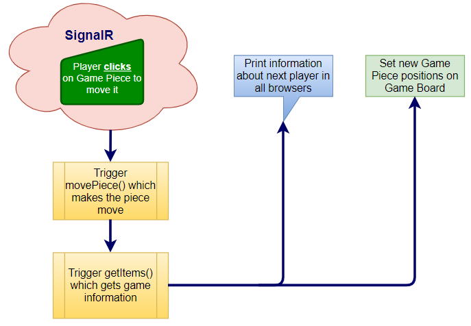

### Description

>We have used [SignalR](https://docs.microsoft.com/en-us/aspnet/core/signalr/introduction?view=aspnetcore-5.0) in order to send informative messages regarding the flow of play in real time to our players.
>Each time a player makes their move a message is sent informing all players of who just made their move. And that it's
>the next players turn. The message regarding their if they can actually move their own piece is only sent to the player attempting to move,
>since that information really only is relevant to them.

-------------

### Async functions

