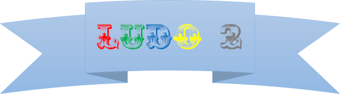

## List of documentation

* [Initial plan](Docs/InitialPlan.md)
* [User stories](Docs/UserStories.md)
* [Database structure](Docs/DatabaseStructure\DatabaseImage.md)
* [Ludo Board](Docs/Images/ludoBoardWithIndexes.jpg) (with indexes)
* [Class structure](DocsClassStructure.md)
* [Api design](Docs/apiDesign.md)
* [Intermittents notes](Docs/flow.md)
* [Resources](Docs/Material.md)
* [SignalR documentation](Docs/vg_async.md)

## How to get started

To use this application you need to: 
- Clone the repository to your local client. 
- Download docker and run docker compose up to start a virtual environment for the database. 
- Start up the project in Visual Studio APS.Net, rightclick on Solution -> Properties -> Multiple startup project -> Set start on RestApi & LudoGame -> Execute
>**OBS!! It's important that both project run on either IIS express or Kestrel, if one or the other is not matching, you will have problem with CORS [Read more about CORS here](https://docs.microsoft.com/en-us/aspnet/core/security/cors?view=aspnetcore-5.0)**
- Choose names for the players
- Submit
- Start to play

### Go back to ongoing game
- Start up the project
- Go to History
- Click on the game you would like to resume

### Swagger
- Opens up when the program starts to get a veiw of the endpoints 
- Enables testing of the endpoints without the frontend
- You can choose to start up RestAPI alone to test it
